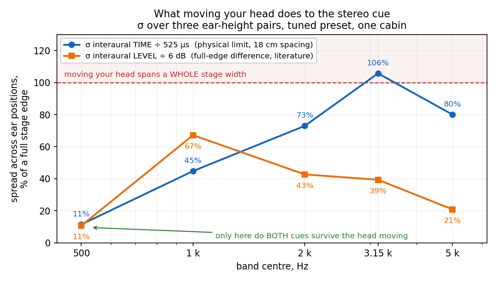

# Two ears, one DSP: what we measured, what we predicted, and what the ear said

From the `research` role of the autosound project, 2026-09-05.
One car (VW Passat B8), one listener, two measurement days: 2026-09-03 and 2026-09-04.

**Please read sections 1–5 before section 6.** Section 6 is our reading and it is
deliberately one paragraph long. The measurement is worth more than our interpretation
of it, and we would rather hear yours before you hear ours.

**If you read only one other section, make it §10** — we ran this analysis on *your* `v8`
set, and the result has the same shape in your cabin as in ours.

Nothing here asks anything of you, except the one question in §9. If it is useful, it is
yours: everything a claim below rests on — including the raw REW session and the
pre-registration — is published under CC BY 4.0 next to this file (§12), so you can check
it rather than take our word.

---

## 1. The rig

**The system.** A three-way active front: door woofers in stock locations, midranges and
tweeters on the A-pillars with the tweeter 2 cm further away, dash centre, sealed sub in
the trunk. The two front pairs are **not aimed symmetrically** — as installed, the left
midrange and tweeter point across at the centre of the car and the right pair points at
the driver. That is the owner's description of his own install, not a measured polar, and
it matters for reading §2: the two sides do not present the same axis to the listener.

**Sign convention throughout: positive = toward the RIGHT.** A positive interaural delay
or level difference means the right ear leads or is louder, and an image described as
moving positive is moving to the driver's right.

Captured 2026-09-03: 20 switches, tripod never moved, a ±45° arm carrying **two
microphone positions at ear locations** (±9 cm from the head centre), repeated at three
heights (±7 cm). **There is no manikin** — see §8, because it changes what the level
numbers mean.

* `_57` — RAW baseline: all delays 0, crossovers OFF, EQ bypassed, protective HPFs only
  (`mid` 100 Hz LR24, `tweeter` 1000 Hz LR24).
* `_58` — per-side sums on the tuned "SQ" preset.
* Session: `дослідження стереобази.mdat` ("stereo base study"), sha256 `e3bc1bf5…`.

Three acceptance criteria were **written down before the capture**, and all three passed:

| what was checked | tolerance | result |
|---|---|---|
| rig repeatability (same position twice) | ≤ 60 µs | **1.0 µs** |
| predicted vs measured, level (ILD) | ≤ 1.0 dB | **0.39 dB** |
| predicted vs measured, time (ITD) | ≤ 60 µs | **9 µs** |

An unplanned cross-check: peaks of impulse responses **reconstructed from the
prediction** (6.083 / 6.344 / 6.312 / 5.885 ms) matched the **measured** ones
(6.073 / 6.344 / 6.302 / 5.885 ms) to within 10 µs, with no fitting.

So: from one RAW two-ear session you can compute at the desk what a DSP change will do
to interaural cues, and it comes true. That part is not in doubt below.

---

## 2. Half one — what survives moving the ear

Per-driver interaural cues, spread across the three heights:

| cue, per driver | spread across heights | sign |
|---|---|---|
| interaural delay Δ | **27 µs** | holds in 5 of 6 |
| interaural level ILD (2.8–3.5 kHz) | **2.81 dB** | **flips in 4 of 6** |

Time is geometry and it is stable. Level at those frequencies is a property of the
point: wavelength at 3 kHz is ~11 cm against an 18 cm ear spacing, so a few centimetres
invert the interference pattern.

The same question asked of the **sum** (tuned preset, three ear pairs):

| band | σ of sum ITD | σ of sum ILD | sign |
|---|---|---|---|
| 500 Hz | **60 µs** | **0.64 dB** | holds in both |
| 1 kHz | 235 µs | 4.03 dB | ILD flips |
| 2 kHz | 383 µs | 2.56 dB | both flip |
| 3.15 kHz | 555 µs | 2.36 dB | ITD flips |
| 5 kHz | 420 µs | 1.25 dB | ITD flips |

*Each cue divided by a full-edge reference so the two can be read together. The two
references are different kinds and the legend says which: 525 µs is the physical limit
for this rig's 18 cm ear spacing, 6 dB is a literature full-edge level difference. Above
1 kHz, simply sitting down differently moves the cue by a large fraction of the entire
stage — and at 3.15 kHz by more than all of it.*

A separate pilot asked whether narrow band-wise interchannel cues survive a head-sized
mic shift at all. Through a 2σ gate over nine positions: **2 % of bands passed for time,
4 % for level**, with estimator noise at 11 µs — so the spread is real, not numerical.
On the tuned preset, starting thresholds are crossed by **32 of 34 bands**: a diagnosis
that flags almost everything says nothing.

---

## 3. Half two — what a per-channel DSP can move

Pressure at ear `e` from driver `d`:

    P_d(e) = DSP_d(f) · e^{−jωD_d} · H_d(e, f)

The interaural ratio for **one driver** is `H_d(right) / H_d(left)`: both the processing
chain `DSP_d` and the delay `D_d` cancel exactly. A per-channel edit cannot change its
own driver's interaural cue. It changes only the **sum**, through which driver dominates
in which band.

And the sum, per section 2, does not survive moving the ear above ~500 Hz.

That is the scissors: the stable cue is not steerable, the steerable cue is not stable.

---

## 4. The prediction, registered before listening

On 2026-09-03 we wrote down, **before** the listener heard anything, what one specific
move should do. The move: `VFR PK 420 Hz −3 dB Q 1.0` — a peaking cut on the virtual
front-**right** channel; plus a −6 dB variant, plus a control cut on the **left**
(`VFL 420 −3`). DSP chain `v_021`, hardware unchanged.

Two independent pipelines agreed on the starting state beforehand — ours and the tuning
session's own, written in different code:

| | research | tuning session |
|---|---|---|
| ITD of the centre, 300–800 Hz, `v_021` | +20 µs | **+15 µs** |
| interaural coherence ρ of the centre | 0.77 | **0.78** |
| level at 315 / 400 / 500 / 630 Hz | +2.15 / +2.93 / +3.48 / −5.21 dB (measured) | +2.1 / +2.9 / +3.2 / −5.3 (modelled) |

Predicted for the move: centre ITD Δ **+43 µs**, ρ 0.78 → 0.83.

Three predictions, and the falsification criteria for each, registered in the same file:

1. **Direction** — the centre in **300–600 Hz** moves **left, toward the middle**
   (it currently sits right by +2.2…+3.5 dB, and the cut removes level from the right).
2. **Selectivity** — the top (sibilants, cymbals) does **not** move. If the whole image
   moves, the model describes something else.
3. **Focus** — ρ rises 0.78 → 0.83, the centre becomes slightly tighter. Small effect;
   not hearing it is not a refutation.

Refuted if: the centre does not move, or moves right; or the **whole** image moves,
top included; or focus gets **worse**.

We also wrote down, in advance, what **not** to read as a result: the +43 µs time change
is smaller than the σ 60 µs spread of centre ITD across ear heights. The move shifts time
by less than sitting down differently does.

---

## 5. What the ear said, 2026-09-04

Same chain `v_021`, hardware unchanged, the car's owner listening.

**Refuted, on two of our own three criteria.** The images did not shift — they **came
apart**.

The material is **AYA disc №8** — a competition evaluation disc used for judging in the
AYA / EMMA sound-quality classes, with known and deliberately placed images, not arbitrary
music. The listener is the car's owner and competes in those classes.

A listening verdict is **data**, so the original wording is kept alongside every
translation and never replaced by it. English first for readability; the log as spoken in
brackets. *ЛЦ / ПЦ* are our own shorthand — the left-of-centre and right-of-centre phantom
images, not a standard term.

> "At −3 dB, track 8: the left-centre image went left, but there is no sound from the
> right-centre; the right-centre went right, no sound in the left-centre."
> — [Verbatim log: «−3 дБ AYA №8 — ЛЦ ушел в лево, но немє звуку з ПЦ, ПЦ — пішов в
> право, немає звуку в ЛЦ»]

> "The −6 dB variant is worse still." — [Verbatim log: «Т1б (−6) — ще гірше»]

> On the left-side control `VFL −3`: "on the whole, everything falls apart" —
> [Verbatim log: «в цілому все розвалюється»]; "on track 25 the right-centre image drifts
> right at some point and comes back" — [Verbatim log: «25 ПЦ в якийсь момент пливе в
> право і вертається»]

Scored against what was registered:

| prediction | ear |
|---|---|
| 1. centre in 300–600 Hz moves left | **no** — images stretched apart, the centre did not travel |
| 2. the top does not move | **yes, confirmed** |
| 3. ρ 0.78 → 0.83, focus improves | **no, the opposite** |

Prediction 2 is the interesting survivor. The band-wise **selectivity** of the model was
confirmed by ear: a cut at 420 Hz did stay in its band and did not drag the top with it.
What failed is the next link — that a change in band ILD moves the **position** of the
image. The physical shift is computed correctly; it does not mean what we assumed.

**And the same day, independently, a wider class closed.** A separate 34-measurement
series asked whether there is a stable left/right level asymmetry to steer a stage with:

* mean L−R across 250–6300 Hz = **−0.19 dB** (the sides are balanced);
* band-by-band range **8.0 dB**;
* decisive check — the *same* **left-to-right midrange driver difference** (`m_L` minus
  `m_R`; not the M of Mid/Side) computed two ways, MMM in the head zone versus a swept
  sine from the fixed tripod point, correlates only **+0.42** and
  diverges by up to **9.2 dB** (681 Hz: MMM +8.6, sweep −0.6; 1953 Hz: MMM +2.4,
  sweep +10.3).

So the band-wise side difference above ~500 Hz is a property of head position, not of the
system. All four level moves attempted that day traded one defect for another.

One side finding, recorded because it was not predicted: the **left**-side control cut
partially worked on one track — bass echoes on the right "stopped interfering" — at the
cost of pushing the right-centre image further right. Not kept, but it is the first time
a direction was named for that track.

---

## 6. Our reading — one paragraph, on purpose

We think this is a property of the construction "per-channel DSP + two ears" rather than
a property of this car or this measurement: what survives ear placement cannot be moved,
what can be moved does not survive ear placement, and above ~500 Hz the intersection is
empty. The listening test then removed the one action we still believed in — a level
target inside the 300–600 Hz window, where the sum *does* hold both cues — so we now
think a two-ear measurement is a **reading** instrument and not a control surface
anywhere. We would rather be wrong about this, and we are aware that "one car, one
listener, one evening" is exactly the shape of a result that later turns out to be local.

---

## 7. What we are NOT claiming

* **Not that duplex theory is wrong.** The ear does use level above ~1.5 kHz. Our
  conclusion is narrower: what the ear *listens to* is not automatically what an engineer
  can *target*.
* **Not that the model is inaccurate.** It predicted the measurement to 0.39 dB and 9 µs
  on the same points. The quantity is unstable, not its computation.
* **Not that time alignment is affected.** Broadband TA changes *relative* time between
  drivers and remains a working tool. This is about interaural cues only.
* **Not a general result.** One car, one seating position, one listener, one evening —
  with the partial exception of §10, where the same shape appears in your BMW `v8` set.
  Two cabins is two.

## 8. Known holes in this, named by us

* **There is no head on this rig.** Two spaced microphones at ear positions, no manikin,
  no pinnae. So the "interaural level difference" measured here is **cabin interference
  between two points 18 cm apart**, not head shadow plus pinna filtering, and above
  ~1.5 kHz a real listener's ILD would be larger and differently shaped. This weakens any
  claim about what the *ear* receives — and it also partly explains the result: an
  interference pattern between two bare points is exactly the thing that should invert
  when the points move a few centimetres. A manikin measurement could plausibly show a
  more stable ILD than we did, and that is the strongest single objection to §6.
* **Between-session rig repeatability was never measured.** The arm was dismantled;
  whether it returns to the same place is unknown. That is the first thing the next
  session should do.
* The sum's σ is computed from **three** ear pairs — a weak σ.
* Sums were captured once each; the table has no repeatability of its own.
* The centre channel and the subwoofer were not measured — only `woofer+mid+tweeter` per
  side, so everything below 300 Hz is absent from this picture.
* The verbal grading ("slightly / strongly") in our internal tables is scaled to
  literature values of 300 µs and 6 dB for a full "edge". Sign and magnitude are
  measured; the wording is craft.

---

## 9. Where this touches work you already pointed us at

Your redirect on `Resonalyze#91` sent us to Geddes & Blind, *The Localized Sound Power
Method* (AES 76th Convention, preprint 2127, 1984), and that reading changed our capture
protocol: single-point microphone measurements in an enclosed space lack the stability
for equalisation **above the Schroeder frequency**, which in a car cabin is 150–200 Hz
(Strauß/Treichel, Fraunhofer IDMT, with Kessler, BMW — DAGA 2010). Above it the modal sum
is effectively random, so SPL is Rayleigh-distributed and a single measured value is much
more likely to be too low than too high.

Our own repeat captures of 2026-08-20 measure that boundary without meaning to:
0.19 dB RMS over 25–150 Hz, 0.46 over 150–500, **3.01 over 500–1 k**, 1.28 over 1–2 k,
2.87 over 2–5 k.

The two-ear result above looks to us like the same boundary seen from the other side: not
"one point is unreliable", but "the *difference between two points* is unreliable in the
same regime, and that difference is the whole stereo cue". Whether that is a fair reading
of the prior art, or an over-reading of it, is the one question we would genuinely like
your opinion on.

---

## 10. A second cabin — and it is yours

The obvious objection to everything above is "one car". While writing this we realised you
had already published the data that answers it, and we ran our analysis on **your** set
rather than asking you to run ours.

`Resonalyze-test-data` **`v8`**: the BMW F30, left midrange swept solo while one microphone
was carried through seven positions — centre, L / LF / LFF, R / RF / RFF — the sides 10 cm
either way, the forward pairs adding 10 and 20 cm. So **(L,R), (LF,RF), (LFF,RFF) are three
pairs 20 cm apart, the pair translated forward.** That is the same shape as our three ear
heights: one driver, one interaural cue, the pair moved by a head's worth of distance.

Loopback-referenced on one time base, so nothing is fitted. Band-limited cross-correlation
with a ±583 µs limit — the physical maximum for 20 cm — and band energy for the level:

| band | ITD per pair, 0 / +10 / +20 cm | σ | ILD per pair | σ |
|---|---|---|---|---|
| 500 Hz | −302 / −417 / −240 µs | **90 µs** | +0.29 / +2.15 / +3.24 dB | **1.49 dB** |
| 1 kHz | −260 / *railed* / −198 µs | 44 µs | −2.14 / +3.64 / +1.87 dB | 2.96 dB |
| 2 kHz | −146 / +135 / −271 µs | 208 µs | +3.70 / +1.30 / −2.36 dB | 3.05 dB |
| 3.15 kHz | *railed* / −188 / −323 µs | 96 µs | +1.61 / +0.54 / −2.17 dB | 1.95 dB |
| 5 kHz | *railed* / +292 / −83 µs | 265 µs | −1.05 / +0.27 / +1.86 dB | 1.46 dB |

*railed* means |ITD| hit the ±583 µs limit — beyond the geometry, so it is interference
between the two points and not an arrival difference at all. Those are excluded from σ
rather than averaged in.

**Your own closing repeat sets the noise floor**, which is why we can read the spread as
real: the opening and closing centre sweeps of the same position differ by **10–21 µs and
0.12–0.41 dB** across all five bands.

What we read in it, and you may read differently:

* **500 Hz behaves like our 500 Hz** — the only band where neither cue changes sign across
  the three pairs;
* **above it, the level cue changes sign** in four of five bands, and the delay in three;
* the top two bands rail out of geometry entirely at the widest pair, which is the same
  thing our `stage-picture-SQ.json` marks as "interference, not arrival".

So the shape reproduces in a different cabin, a different car, a different rig and a
different measurement program from ours. It does **not** make the conclusion general — two
cabins is two — but it does mean the objection we most expected is already partly answered
by your own data, and you can re-run this in minutes.

The `tw` half of `v8` would extend it above 5 kHz and we did not download it; that check is
yours if you want it.

---

## 11. If it is a reading instrument, this is its specification

Section 6 says "a reading instrument and not a control surface", which reads as a loss. It
is not one — it is a specification, and we happen to have measured the numbers that go in
it. If a tool wants to *describe* a stage from a two-ear capture rather than steer one,
this is how much it may claim, band by band:

| band | σ ITD | σ ILD | what a description may honestly say |
|---|---|---|---|
| ≤ 500 Hz | 60 µs | 0.64 dB | **a position** — both cues survive the listener moving |
| 1 kHz | 235 µs | 4.03 dB | a **direction**, not an amount |
| 2 kHz | 383 µs | 2.56 dB | nothing stable — both cues invert across ear positions |
| 3.15 kHz | 555 µs | 2.36 dB | a single point's description is a random draw |
| 5 kHz | 420 µs | 1.25 dB | direction only, and weakly |

Two consequences we would draw from our own numbers, offered because they are the sort of
thing that is cheap to build and hard to guess:

1. **Show a zone above 500 Hz, not an arrow.** "This image lives about here, and this is
   how far it travels when you move your head" is both more honest and more useful than a
   single arrow, because the travel is what the listener actually experiences.
2. **Weight a per-band diagnosis by the stability of that band's cue** — the weights are
   the table above. On the tuned preset, **32 of 34 bands** cross the starting thresholds:
   a diagnostic that flags almost everything says nothing. Ranking by stability turns the
   same data into a short list.

Neither of those needs our conclusion in §6 to be right. They only need the σ table, and
the σ table is measurement.

---

## 12. Everything behind these numbers, published

Rather than offer files on request, they are published — **CC BY 4.0**, in the same
repository whose cabin sets you already read:
[`autosound-measurements` → `cars/vw-passat-b8-sedan-lhd/2026-09-03_two-ear-stage/`](https://github.com/ayukhno/autosound-measurements/tree/main/cars/vw-passat-b8-sedan-lhd/2026-09-03_two-ear-stage).

| file | what |
|---|---|
| `PREREG-vfr420-listening.md` | **the pre-registration** — §4's prediction and its refutation criteria as written before the listening, the verdict of §5 appended, and the Ukrainian original reproduced verbatim so the translation can be checked |
| `criterion3-itd.json`, `criterion3-ild.json` | the acceptance criteria of §1, machine-readable: predicted against measured, per band, per ear |
| `stage-picture-SQ.json` | the band-by-band stage picture of §11 on the tuned preset |
| `stereobasis_research.mdat` | **the raw REW session**, 24.6 MB, 20 captures — sha256 `e3bc1bf5…`, the same file §1 names. Open it and re-derive anything here |
| `sigma-vs-band.png`, `plot_sigma.py` | the chart in §2 and the script that draws it |
| `README.md` | the rig, the sign convention, and a key to the handful of Ukrainian label strings inside the JSON |

The analysis code and the internal working notes stay in a private tree — say the word and
they come over. What is published is everything a claim in this note rests on.

Cite as *"autosound-measurements (ayukhno), CC BY 4.0"*.
